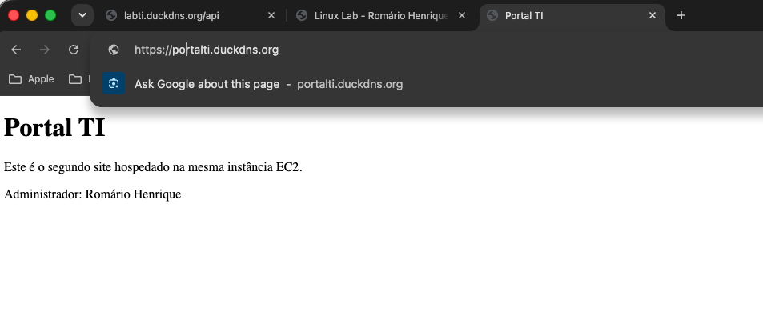
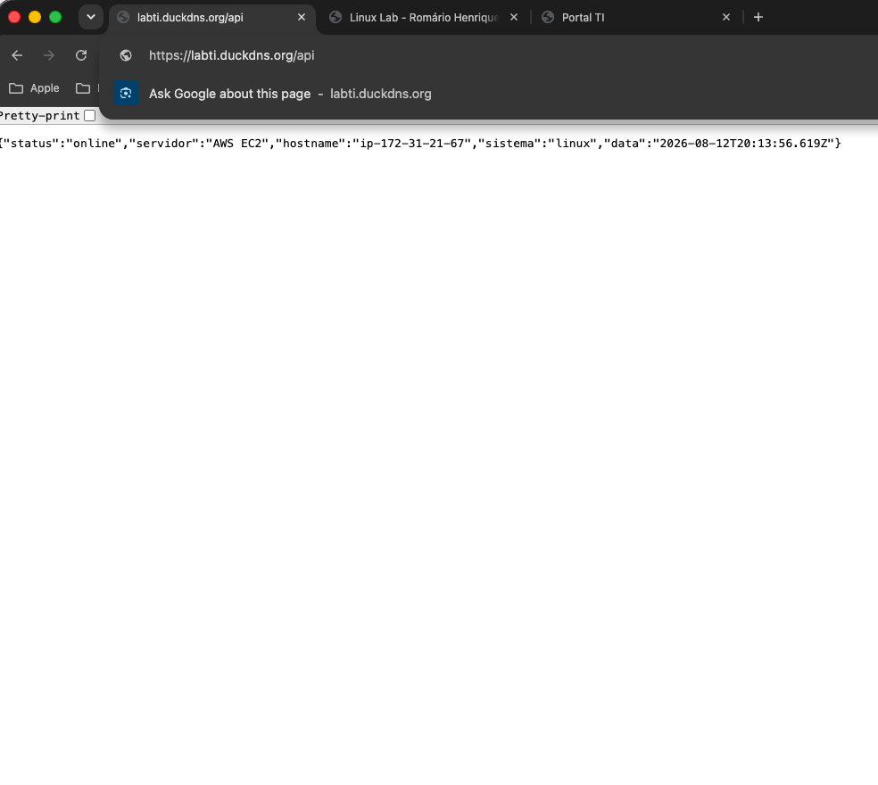
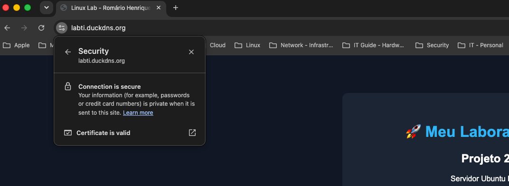
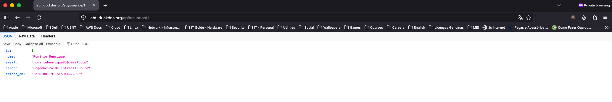
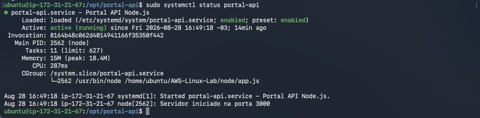

# 🚀 AWS Linux Lab

> Laboratório prático de Infraestrutura Linux, Cloud Computing e DevOps, desenvolvido em uma instância Ubuntu na Amazon EC2.

---

# 📌 Objetivo

Este repositório documenta minha evolução prática em Administração Linux, Cloud Computing e DevOps.

Durante os projetos são implementadas soluções semelhantes às encontradas em ambientes corporativos, utilizando Linux, Nginx, HTTPS, Node.js, PostgreSQL e outras tecnologias amplamente adotadas pelo mercado.

Cada projeto amplia a arquitetura do anterior, formando uma infraestrutura completa construída passo a passo.

---

# 🏗 Arquitetura

```text
                    Internet
                        │
                  HTTPS (443)
                        │
                Nginx (Reverse Proxy)
                  │               │
                  │               │
        Site Institucional     API Node.js
          (HTML/CSS)           Express
                                   │
                                   │
                             PostgreSQL
```

---

# 🛠 Tecnologias

- Ubuntu Server 26.04
- Amazon EC2
- Linux
- SSH
- Git
- GitHub
- Nginx
- Node.js
- Express
- PostgreSQL
- Systemd
- Let's Encrypt
- Certbot
- DuckDNS

---

# 📂 Estrutura do Projeto

```text
AWS-Linux-Lab
├── docs/
├── html/
├── nginx/
├── node/
├── screenshots/
└── README.md
```

---

# 📸 Demonstração

## Página Principal



---

## API Node.js



---

## HTTPS funcionando



---

## API consultando usuários


---

## Consulta por ID



---

## PostgreSQL


---

## Status da API



---

## Estrutura do Projeto


---

# 📚 Competências desenvolvidas

Durante este laboratório foram desenvolvidas competências em:

- Administração Linux
- Gerenciamento de serviços com Systemd
- Configuração de Nginx
- Reverse Proxy
- HTTPS com Let's Encrypt
- Desenvolvimento de APIs REST
- Integração Node.js + PostgreSQL
- SQL (CRUD)
- Git e GitHub
- Organização de infraestrutura em ambiente Cloud

---

# 🚀 Próximos Projetos

- ✅ Projeto 1 — Linux
- ✅ Projeto 2 — Nginx
- ✅ Projeto 3 — HTTPS
- ✅ Projeto 4 — API Node.js
- ✅ Projeto 5 — PostgreSQL

## Em desenvolvimento

- 🔜 Projeto 6 — Docker
- 🔜 Projeto 7 — Docker Compose
- 🔜 Projeto 8 — GitHub Actions
- 🔜 Projeto 9 — Terraform
- 🔜 Projeto 10 — Kubernetes

---

# 👨‍💻 Autor

**Romário Henrique**

Estudante de Infraestrutura, Cloud Computing e DevOps.

GitHub:
https://github.com/romarioluzh