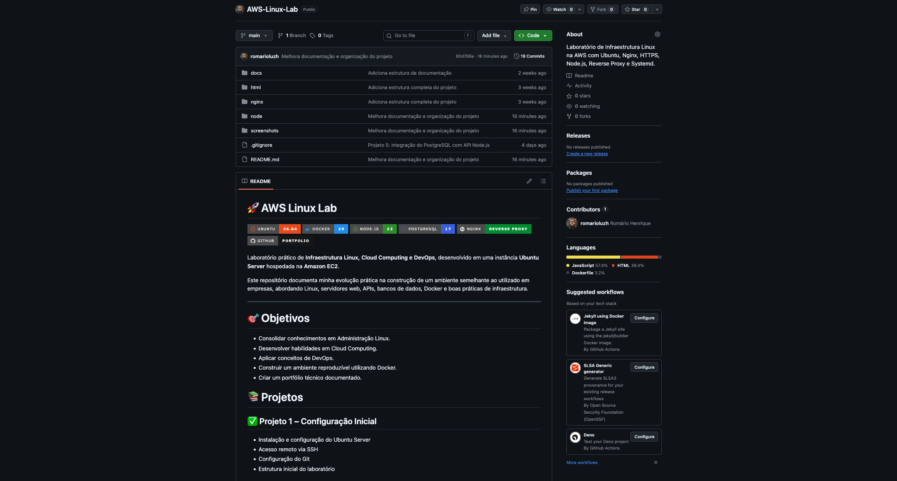
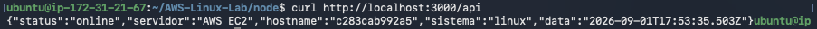
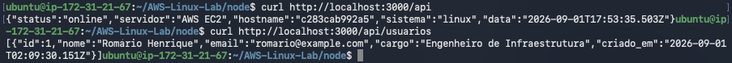
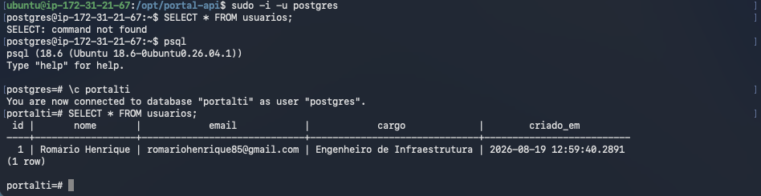
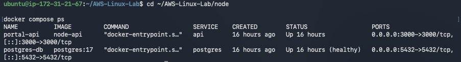
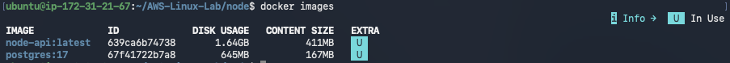
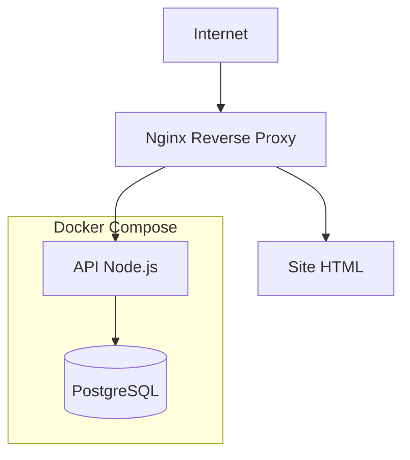
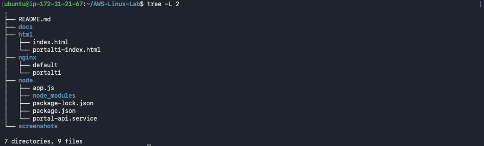

# 🚀 AWS Linux Lab

<p align="center">


</p>

Laboratório prático de **Infraestrutura Linux, Cloud Computing e DevOps** desenvolvido em uma instância **Ubuntu Server** hospedada na **Amazon EC2**.

O objetivo deste repositório é documentar minha evolução prática na construção de um ambiente semelhante ao utilizado em empresas, utilizando Linux, Nginx, HTTPS, Node.js, PostgreSQL, Docker e Docker Compose.

---

# 📸 Visão Geral



---

# 🎯 Objetivos

- Desenvolver habilidades em Administração Linux.
- Aprender conceitos de Cloud Computing.
- Construir aplicações em ambiente Linux.
- Utilizar containers Docker em ambientes reais.
- Integrar APIs com bancos de dados PostgreSQL.
- Criar um portfólio técnico documentado.

---

# 📚 Projetos

## ✅ Projeto 1 – Configuração Inicial

- Instalação do Ubuntu Server
- Configuração da Amazon EC2
- Acesso remoto via SSH
- Configuração do Git e GitHub

---

## ✅ Projeto 2 – Servidor Web

- Instalação do Nginx
- Configuração de Virtual Hosts
- Publicação de site HTML
- Estrutura inicial do laboratório

---

## ✅ Projeto 3 – HTTPS

- Configuração do Certbot
- Certificados Let's Encrypt
- DuckDNS
- Renovação automática

---

## ✅ Projeto 4 – API REST

- Node.js
- Express
- Systemd
- API REST

### Status da API



### Consulta de Usuários



---

## ✅ Projeto 5 – PostgreSQL

- Instalação do PostgreSQL
- Banco de dados relacional
- Integração com Node.js
- Consultas SQL

### Consulta ao Banco



---

## ✅ Projeto 6 – Docker e Docker Compose

- Docker Engine
- Dockerfile
- Docker Compose
- Containers
- Volumes
- Variáveis de ambiente
- Healthcheck
- Inicialização automática do banco

### Containers em Execução



### Imagens Docker



---

# 🏗 Arquitetura

O ambiente foi construído simulando uma infraestrutura real, onde o **Nginx** atua como Reverse Proxy, encaminhando as requisições para a aplicação Node.js, que por sua vez se comunica com o banco de dados PostgreSQL. A aplicação e o banco são executados em containers Docker gerenciados pelo Docker Compose.



### 📸 Arquitetura do Projeto



---

# 📂 Estrutura do Projeto

```text
AWS-Linux-Lab/
│
├── docs/
│
├── html/
│
├── nginx/
│
├── node/
│   ├── Dockerfile
│   ├── docker-compose.yml
│   ├── init-db/
│   │   └── init.sql
│   ├── app.js
│   ├── package.json
│   ├── package-lock.json
│   ├── .env.example
│   └── portal-api.service
│
├── screenshots/
│
├── .gitignore
│
└── README.md
```

---

# 🛠 Tecnologias Utilizadas

| Tecnologia | Finalidade |
|------------|------------|
| Ubuntu Server 26.04 | Sistema Operacional |
| Amazon EC2 | Infraestrutura em Nuvem |
| Linux | Administração do servidor |
| Git | Versionamento |
| GitHub | Hospedagem do código |
| Nginx | Servidor Web e Reverse Proxy |
| Let's Encrypt | Certificados HTTPS |
| Node.js | Backend |
| Express | Framework Web |
| PostgreSQL | Banco de Dados |
| Docker | Containers |
| Docker Compose | Orquestração |
| Bash | Administração do ambiente |

---

# 🚀 Como executar

## Pré-requisitos

Antes de iniciar, certifique-se de possuir os seguintes componentes instalados:

- Docker
- Docker Compose
- Git

---

## 1️⃣ Clonar o repositório

```bash
git clone https://github.com/romarioluzh/AWS-Linux-Lab.git
```

---

## 2️⃣ Acessar o projeto

```bash
cd AWS-Linux-Lab/node
```

---

## 3️⃣ Criar o arquivo de configuração

Copie o arquivo de exemplo:

```bash
cp .env.example .env
```

Edite o arquivo `.env` conforme necessário.

---

## 4️⃣ Construir e iniciar os containers

```bash
docker compose up --build -d
```

---

## 5️⃣ Verificar os containers

```bash
docker compose ps
```

Resultado esperado:


---

## 6️⃣ Testar a API

Verificar se a API está online:

```bash
curl http://localhost:3000/api
```

Resultado esperado:


---

Consultar usuários cadastrados:

```bash
curl http://localhost:3000/api/usuarios
```

Resultado esperado:


---

## 7️⃣ Verificar o banco de dados

Acessar o PostgreSQL:

```bash
docker exec -it postgres-db psql -U postgres -d portalti
```

Consultar os registros:

```sql
SELECT * FROM usuarios;
```

Resultado esperado:


---

# 🎯 Competências Desenvolvidas

Durante este laboratório foram praticados conceitos de:

- Administração Linux
- Amazon EC2
- Redes TCP/IP
- SSH
- Git e GitHub
- Nginx
- HTTPS com Let's Encrypt
- Reverse Proxy
- Node.js
- Express
- PostgreSQL
- Docker
- Docker Compose
- Dockerfile
- Volumes Docker
- Redes Docker
- Variáveis de ambiente
- Health Checks
- APIs REST

---

# 🚧 Roadmap

Este laboratório continuará evoluindo com novos projetos.

## ✅ Concluído

- [x] Linux
- [x] Git e GitHub
- [x] Nginx
- [x] HTTPS com Let's Encrypt
- [x] API Node.js
- [x] PostgreSQL
- [x] Docker
- [x] Docker Compose

## 🔜 Próximos Projetos

- [ ] Reverse Proxy com Nginx em Docker
- [ ] CI/CD com GitHub Actions
- [ ] Monitoramento com Prometheus
- [ ] Dashboards com Grafana
- [ ] Kubernetes
- [ ] Terraform
- [ ] Deploy automatizado

---

# 💡 Objetivo do Laboratório

Este projeto foi criado para documentar minha evolução prática em Infraestrutura, Cloud Computing e DevOps.

Mais do que executar comandos, o foco deste laboratório é compreender como as tecnologias se integram em um ambiente semelhante ao utilizado em produção.

Cada novo projeto amplia a infraestrutura existente, permitindo consolidar conhecimentos por meio de experiências práticas e documentação contínua.

---

# 👨‍💻 Autor

**Romário Henrique**

Projeto desenvolvido para estudos em:

- Infraestrutura Linux
- Cloud Computing
- DevOps

GitHub:

https://github.com/romarioluzh

---

⭐ Se este projeto foi útil ou interessante para você, considere deixar uma estrela no repositório.
