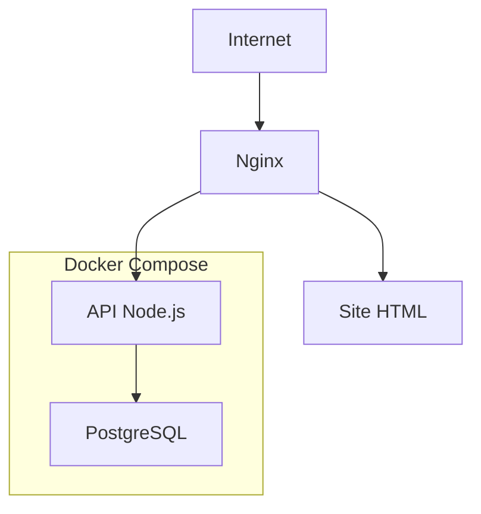

# 🚀 AWS Linux Lab


Laboratório prático de **Infraestrutura Linux, Cloud Computing e DevOps**, desenvolvido em uma instância **Ubuntu Server** hospedada na **Amazon EC2**.

Este repositório documenta minha evolução prática na construção de um ambiente semelhante ao utilizado em empresas, abordando Linux, servidores web, APIs, bancos de dados, Docker e boas práticas de infraestrutura.

---

# 🎯 Objetivos

- Consolidar conhecimentos em Administração Linux.
- Desenvolver habilidades em Cloud Computing.
- Aplicar conceitos de DevOps.
- Construir um ambiente reproduzível utilizando Docker.
- Criar um portfólio técnico documentado.

# 📚 Projetos

## ✅ Projeto 1 – Configuração Inicial

- Instalação e configuração do Ubuntu Server
- Acesso remoto via SSH
- Configuração do Git
- Estrutura inicial do laboratório

---

## ✅ Projeto 2 – Servidor Web

- Instalação do Nginx
- Configuração de Virtual Hosts
- Publicação de um site HTML estático

---

## ✅ Projeto 3 – HTTPS

- Configuração do Certbot
- Emissão de certificados Let's Encrypt
- Configuração de domínio com DuckDNS
- Renovação automática dos certificados

---

## ✅ Projeto 4 – API REST

- Desenvolvimento de API em Node.js
- Framework Express
- Gerenciamento do serviço com Systemd
- Endpoints para monitoramento

---

## ✅ Projeto 5 – Integração com PostgreSQL

- Instalação e configuração do PostgreSQL
- Criação de banco de dados
- Integração da API com PostgreSQL
- Consultas SQL utilizando Node.js

---

## ✅ Projeto 6 – Docker e Docker Compose

- Instalação do Docker Engine
- Construção de imagens com Dockerfile
- Orquestração com Docker Compose
- Containers para API Node.js e PostgreSQL
- Persistência de dados com Volumes
- Variáveis de ambiente (.env)
- Inicialização automática do banco com init.sql
- Healthcheck entre serviços

---

# 🏗 Arquitetura



---

# 📂 Estrutura do Projeto

```text
AWS-Linux-Lab
│
├── docs/
├── html/
├── nginx/
├── node/
│   ├── Dockerfile
│   ├── docker-compose.yml
│   ├── init-db/
│   │   └── init.sql
│   ├── app.js
│   ├── package.json
│   ├── package-lock.json
│   └── .env.example
│
├── screenshots/
└── README.md
```

---

# 🛠 Tecnologias

| Tecnologia | Finalidade |
|------------|------------|
| Ubuntu Server | Sistema Operacional |
| Amazon EC2 | Computação em Nuvem |
| Nginx | Servidor Web e Reverse Proxy |
| Node.js | Backend |
| Express | API REST |
| PostgreSQL | Banco de Dados |
| Docker | Containers |
| Docker Compose | Orquestração |
| Git | Versionamento |
| GitHub | Hospedagem do código |

---

# 🚀 Como executar

## 1. Clonar o repositório

```bash
git clone https://github.com/romarioluzh/AWS-Linux-Lab.git
```

## 2. Entrar no diretório da aplicação

```bash
cd AWS-Linux-Lab/node
```

## 3. Criar o arquivo de configuração

```bash
cp .env.example .env
```

Edite o arquivo `.env` com as configurações desejadas.

## 4. Iniciar os containers

```bash
docker compose up --build -d
```

## 5. Verificar se os containers estão em execução

```bash
docker compose ps
```

## 6. Testar a API

Status da API:

```bash
curl http://localhost:3000/api
```

Status do banco de dados:

```bash
curl http://localhost:3000/api/status-db
```

Listar usuários:

```bash
curl http://localhost:3000/api/usuarios
```
---

# 🎯 Competências desenvolvidas

- Administração Linux
- Amazon EC2
- Git e GitHub
- Nginx
- HTTPS com Let's Encrypt
- Node.js
- Express
- PostgreSQL
- Docker
- Docker Compose
- Dockerfile
- Redes Docker
- Volumes
- Variáveis de ambiente
- Health Checks
- APIs REST

---

# 🚧 Roadmap

- [x] Linux
- [x] Nginx
- [x] HTTPS
- [x] Node.js
- [x] PostgreSQL
- [x] Docker
- [x] Docker Compose
- [ ] Reverse Proxy com Nginx em Docker
- [ ] CI/CD com GitHub Actions
- [ ] Kubernetes
- [ ] Terraform

---

# 👨‍💻 Autor

**Romário Henrique**

Projeto desenvolvido como laboratório prático para estudos em Linux, Cloud Computing, Infraestrutura e DevOps.
